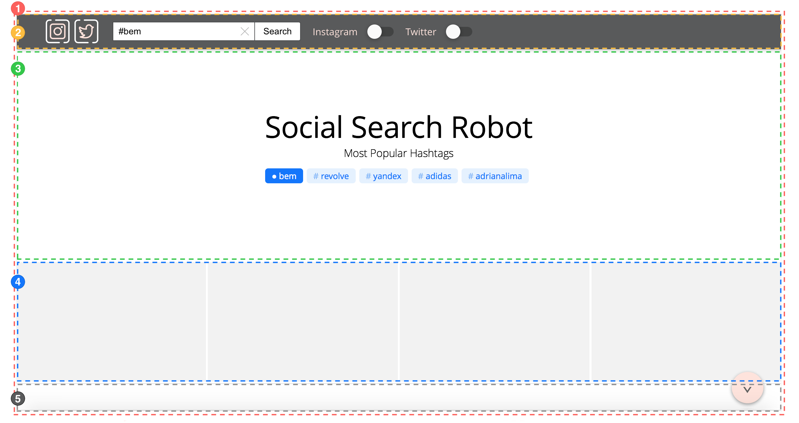

# Создаем динамический проект на БЭМ

* [Обзор](#Обзор)
* [Перед началом работы](#Перед-началом-работы)
* [Начало работы](#Начало-работы)
* [Верстка](#Верстка)
* [Устранение неполадок](#Устранение-неполадок)

## Обзор

Этот документ посвящен созданию динамического приложения с использованием [БЭМ-платформы](https://ru.bem.info/platform/). После прочтения вы сможете быстро и с небольшими усилиями разрабатывать собственные веб-приложения, ориентированные на динамические данные.

Мы создадим проект ([Social Search Robot](#)), используя:

* принципы работы с [CSS по БЭМ](../../method/bem-for-css/bem-for-css.ru.md);
* фреймворк [i-bem.js](https://ru.bem.info/platform/i-bem/);
* технологию для описания зависимостей [DEPS](https://ru.bem.info/platform/deps/);
* шаблонизаторы [BEMHTML, BEMTREE](https://ru.bem.info/platform/bem-xjst/).

### Демонстрация


## Перед началом работы

Документ предназначен для веб-разработчиков знакомых с:

* HTML;
* CSS;
* JavaScript;
* БЭМ.

## Начало работы

* [Настройка окружения](#Настройка-окружения)
* [Создание репозитория проекта](#Создание-репозитория-проекта)
* [Файловая структура проекта](#Файловая-структура-проекта)
* [Создание страницы](#Создание-страницы)
* [Декларация БЭМ-сущностей](#Декларация-БЭМ-сущностей)

### Настройка окружения

Для начала работы необходимо установить:

* [Node.js 4.0+](http://nodejs.org/);
* [Git Bash](https://git-for-windows.github.io/) — для пользователей операционной системы Windows.

### Создание репозитория проекта

Оптимальный путь создать динамический проект на БЭМ — использовать шаблонный репозиторий [bem-express](https://github.com/bem/bem-express). Он содержит необходимый минимум конфигурационных файлов, пакетов и позволяет быстро развернуть свой проект.

Нам понадобится локальная копия `bem-express`. Её можно сделать любым удобным для вас способом. Мы будем использовать Git.

> **Примечание** Пользователям Windows необходимо выполнять все команды в Git Bash. Убедитесь, что Git Bash запущен от имени администратора.

1. Клонируем репозиторий:

  ```bash
  git clone https://github.com/bem/bem-express test-project
  ```

2. Переходим в директорию проекта:

  ```bash
  cd test-project
  ```

3. Удаляем историю версионирования исходного репозитория:

  ```bash
  rm -rf .git
  ```

4. Инициализируем собственный репозиторий в директории проекта:

  ```bash
  git init
  ```

5. Устанавливаем зависимости:

  ```bash
  npm install
  ```

  > **Примечание** Не используйте права суперпользователя (`root`) при установке npm- и bower-зависимостей. Bower-зависимости ставятся при выполнении `npm postinstall` в директории `libs`.

6. Собираем проект с помощью [ENB](https://ru.bem.info/toolbox/enb/):

  ```bash
  ./node_modules/.bin/enb make
  ```

  > **Примечание** Конфигурация процесса сборки хранится в файле `.enb/make.js`. На её основе ENB подключает все технологии, которые составляют реализацию блоков: шаблоны, зависимости, CSS-правила и JavaScript-функциональность.

7. Запускаем сервер:

  ```bash
  npm start
  ```

  В результате вы увидите следующее сообщение:

  `Server is listening on 3000`

  На вашем компьютере запустился сервер, который будет выполнять код, отвечающий за обработку динамических данных. Результат доступен по ссылке: [http://localhost:3000](http://localhost:3000).

  > **Примечание** Если порт 3000 уже используется другой программой, его можно переназначить в файле `server/config.js`. Например, на `8000`.

  ```js
  module.exports = {
      staticFolder: 'static',
      defaultPort: 8000,
      cacheTTL: 80000,
      sessionSecret: 'REPLACE_ME_WITH_RANDOM_STRING'
  };
  ```

### Файловая структура проекта

В результате выполненных действий локальная копия проекта должна иметь следующую файловую структуру:

```files
test-project/
    .enb/                 # Конфигурационные файлы для сборщика ENB
    common.blocks/        # Базовые реализации блоков
    desktop.bundles/      # Директории бандлов проекта
    development.blocks/   # Блоки, подключаемые в процессе разработки (не для Production)  
    libs/                 # Библиотеки
    node_modules/         # Пакеты
    server/               # Директория с серверным кодом
    static/               # Корневая директория для раздачи статических файлов
    .borschik             # Конфигурация сборщика файлов Borschik
    .bowerrc              # Конфигурация менеджера пакетов Bower
    README.md             # Текстовое описание проекта
    bower.json            # Список зависимостей для Bower
    nodemon.json          # Конфигурация для пакета Nodemon
    package.json          # Описание проекта для npm
```

### Создание страницы

Исходники страниц размещаются в каталоге `desktop.bundles`. Изначально в проекте присутствует главная страница `index` с блоками:

* `header`;
* `body`;
* `footer`.

Блок `body` возвращает текст 'body content', который отобразится на экране.

Для создания страницы необходимо:

1. Разместить в `desktop.bundles` каталог с именем страницы, например, `hello`.
2. Добавить в него файл `hello.bemdecl.js`.
3. Перечислить необходимые для построения страницы [БЭМ-сущности](../../method/key-concepts/key-concepts.ru.md#БЭМ-сущность), например:

  ```js
  exports.blocks = [
    { name: 'header' },
    { name: 'body' },
    { name: 'footer' }
  ];
  ```

Такой список называется декларацией. Инструмент сборки, основываясь на данных из декларации, добавляет в [бандлы](../../method/build/build.ru.md#Введение) только перечисленные БЭМ-сущности.

> Подробнее о том, как построить декларацию, см. в разделе [Способы получения декларации](../../method/declarations/declarations.ru.md#Способы-получения-декларации).

### Декларация БЭМ-сущностей

В `bem-express` задекларирован служебный блок [root](https://github.com/bem/bem-express/blob/master/desktop.bundles/index/index.bemdecl.js):

```js
exports.blocks = [
    { name: 'root' }
];  
```

Служит для подключения шаблона блока [page](https://github.com/bem/bem-express/blob/master/common.blocks/root/root.bemtree.js):

```js
block('root').replace()(function() {
    var ctx = this.ctx,
        data = this.data = ctx.data,
        meta = data.meta || {},
        og = meta.og || {};

    if (ctx.context) return ctx.context;

    return {
        block: 'page',
        title: data.title,
        favicon: '/favicon.ico',
        styles: [
            {
                elem: 'css',
                url: '/index.min.css'
            }
        ],
        scripts: [
            {
                elem: 'js',
                url: '/index.min.js'
            }
        ],
        head: [
            { elem: 'meta', attrs: { name: 'description', content: meta.description } },
            { elem: 'meta', attrs: { property: 'og:title', content: og.title || data.title } },
            { elem: 'meta', attrs: { property: 'og:url', content: og.url } },
            { elem: 'meta', attrs: { property: 'og:site_name', content: og.siteName } },
            { elem: 'meta', attrs: { property: 'og:locale', content: og.locale || 'en_US' } },
            { elem: 'meta', attrs: { property: 'og:type', content: 'website' } },
            { elem : 'meta', attrs : { name : 'viewport', content : 'width=device-width, initial-scale=1' } }
        ],
        mods: {
            theme: 'islands',
            view: data.view
        }
    };
});  
```


## Верстка

Перед тем, как мы начнем писать код, нужно определить из каких основных блоков будет состоять проект.

### Основные блоки



1. [Блок page](#).
2. [Блок header](#).
3. [Блок home](#).
4. [Блок serp](#).
5. [Блок footer](#).

### Блок `page`

### Блок `header`

### Блок `home`

### Блок `serp`

### Блок `footer`


### Создание блока


### Переопределение библиотечных блоков

### Создание кастомных блоков


## Устранение неполадок

Если ваш код не работает:

* Ищите опечатки. Помните, что язык JavaScript чувствителен к регистру символов.
* Используйте для выявления проблем отладчик JavaScript, например, отладчик в составе набора инструментов Яндекс.Браузера. Начните поиск ошибок в консоли JavaScript.
* Проверьте все ли зависимости указаны.
* Ознакомьтесь с нашим [примером реализации](#).
* Задавайте вопросы на [форуме](https://ru.bem.info/forum/).
