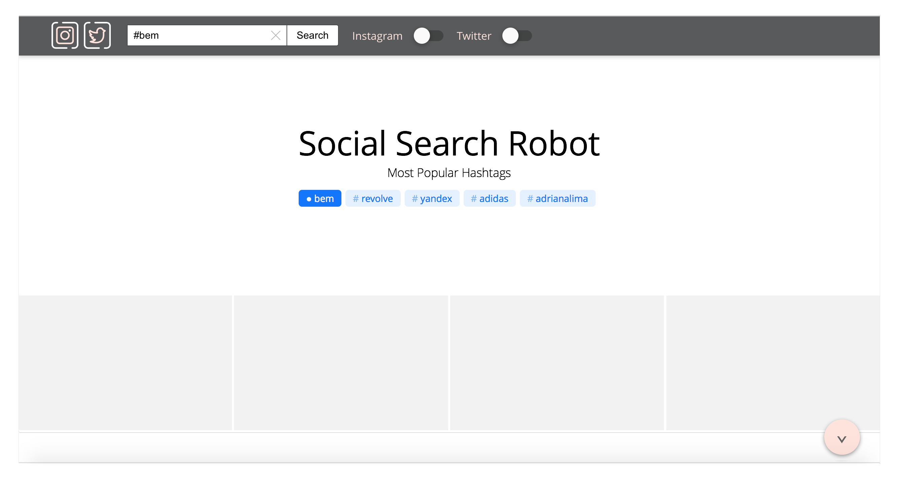

# Создаем динамический проект на БЭМ

* [Обзор](#Обзор)
* [Перед началом работы](#Перед-началом-работы)
* [Начало работы](#Начало-работы)
* [Верстка](#Верстка)
* [Устранение неполадок](#Устранение-неполадок)

## Обзор

Этот документ посвящен созданию динамического приложения с использованием [БЭМ-платформы](https://ru.bem.info/platform/). После прочтения вы сможете быстро и с небольшими усилиями разрабатывать собственные веб-приложения, ориентированные на динамические данные.

Мы создадим проект ([Social Services Search Robot](#)), используя:

* принципы работы с [CSS по БЭМ](../../method/bem-for-css/bem-for-css.ru.md);
* фреймворк [i-bem.js](https://ru.bem.info/platform/i-bem/);
* технологию для описания зависимостей [DEPS](https://ru.bem.info/platform/deps/);
* шаблонизаторы [BEMHTML, BEMTREE](https://ru.bem.info/platform/bem-xjst/).

### Демонстрация



## Перед началом работы

Документ предназначен для веб-разработчиков знакомых с:

* HTML;
* CSS;
* JavaScript;
* БЭМ.

## Начало работы

* [Настройка окружения](#Настройка-окружения)
* [Создание репозитория проекта](#Создание-репозитория-проекта)
* [Файловая структура проекта](#Файловая-структура-проекта)
* [Создание страницы](#Создание-страницы)
* [Декларация БЭМ-сущностей](#Декларация-БЭМ-сущностей)

### Настройка окружения

Для начала работы необходимо установить:

* [Node.js 4.0+](http://nodejs.org/);
* [Git Bash](https://git-for-windows.github.io/) — для пользователей операционной системы Windows.

### Создание репозитория проекта

Оптимальный путь создать динамический проект на БЭМ — использовать шаблонный репозиторий [bem-express](https://github.com/bem/bem-express). Он содержит необходимый минимум конфигурационных файлов, пакетов и позволяет быстро развернуть свой проект.

Нам понадобится локальная копия `bem-express`. Её можно сделать любым удобным для вас способом. Мы будем использовать Git.

> **Примечание** Пользователям Windows необходимо выполнять все команды в Git Bash. Убедитесь, что Git Bash запущен от имени администратора.

1. Клонируем репозиторий:

  ```bash
  git clone https://github.com/bem/bem-express test-project
  ```

2. Переходим в директорию проекта:

  ```bash
  cd test-project
  ```

3. Удаляем историю версионирования исходного репозитория:

  ```bash
  rm -rf .git
  ```

4. Инициализируем собственный репозиторий в директории проекта:

  ```bash
  git init
  ```

5. Устанавливаем зависимости:

  ```bash
  npm install
  ```

  > **Примечание** Не используйте права суперпользователя (`root`) при установке npm- и bower-зависимостей. Bower-зависимости ставятся при выполнении `npm postinstall` в директории `libs`.

6. Собираем проект и запускаем сервер:

  ```bash
  npm run dev
  ```

  > **Примечание** Сборка происходит с помощью [ENB](https://ru.bem.info/toolbox/enb/). Конфигурация процесса сборки хранится в файле `.enb/make.js`. На её основе ENB подключает все технологии, которые составляют реализацию блоков: шаблоны, зависимости, CSS-правила и JavaScript-функциональность.

  В результате вы увидите следующее сообщение:

  `Server is listening on 3000`

  На вашем компьютере запустился:
  * сервер, который будет выполнять код, отвечающий за обработку динамических данных;
  * [nodemon](https://github.com/remy/nodemon/), который будет следить за изменениями на файловой структуре и перезапускать сервер;
  * [chokidar](https://github.com/paulmillr/chokidar), который будет следить за изменениями в директориях `*.blocks/` и перестраивать структуру проекта;
  * [livereload](https://github.com/napcs/node-livereload), который будет обновлять страницу в браузере.

  **Результат доступен по ссылке:** [http://localhost:3000](http://localhost:3000).

  Должна открыться страница со следующим контентом:

  ```text
  body content
  footer content
  ```

  > **Примечание** Если порт 3000 уже используется другой программой, его можно переназначить в файле `server/config.js`. Например, на `8000`.

  ```js
  module.exports = {
      staticFolder: 'static',
      defaultPort: 8000,
      cacheTTL: 80000,
      sessionSecret: 'REPLACE_ME_WITH_RANDOM_STRING'
  };
  ```

### Файловая структура проекта

В результате выполненных действий локальная копия проекта должна иметь следующую файловую структуру:

```files
test-project/
    .enb/                 # Конфигурационные файлы для сборщика ENB
    common.blocks/        # Базовые реализации блоков
    desktop.bundles/      # Директории бандлов проекта
    development.blocks/   # Блоки, подключаемые в процессе разработки (не для Production)  
    libs/                 # Библиотеки
    node_modules/         # Пакеты
    server/               # Директория с серверным кодом
    static/               # Корневая директория для раздачи статических файлов
    .borschik             # Конфигурация сборщика файлов Borschik
    .bowerrc              # Конфигурация менеджера пакетов Bower
    README.md             # Текстовое описание проекта
    bower.json            # Список зависимостей для Bower
    nodemon.json          # Конфигурация для пакета Nodemon
    package.json          # Описание проекта для npm
```

### Создание страницы

Исходники страниц размещаются в директории `desktop.bundles`. Все страницы создаются по принципу: одна страница — одна директория.

Чтобы создать страницу (например, `hello`) необходимо:

1. Разместить в `desktop.bundles` директорию `hello`.
2. Добавить в нее файл ([декларацию](../../method/declarations/declarations.ru.md)) `hello.bemdecl.js`.
3. Описать декларацию — составить список блоков, элементов и модификаторов, используемых на странице.

  Пример декларации `hello.bemdecl.js`:

  ```js
  exports.blocks = [
    { name: 'header' },
    { name: 'body' },
    { name: 'footer' }
  ];
  ```

4. Создать в `common.blocks` директории перечисленных блоков:

  ```files
  test-project/
      common.blocks/        # Базовые реализации блоков
          header/           # Директории блока header
          body/             # Директории блока body
          footer/           # Директории блока footer
  ```

5. Описать реализации блоков, например:

  ```files
  test-project/
      common.blocks/               # Базовые реализации блоков
          header/                  # Директории блока header
              header.bemtree.js    # Шаблон блока header
          body/                    # Директории блока body
              body.bemtree.js      # Шаблон блока body
          footer/                  # Директории блока footer
              footer.bemtree.js    # Шаблон блока footer
  ```

  Пример шаблона `header.bemtree.js`:

  ```js
  block('header').content()(function() {
      return [
          'header content'
      ];
  });
  ```

  > **Примечание** Подробнее о [синтаксисе шаблонов](https://ru.bem.info/platform/bem-xjst/templates-syntax/).

6. Описать серверную часть в файле `server/index.js`:

  ```js
  app.get('/hello/', function(req, res) {
      render(req, res, {
          view: 'hello',
          title: 'Hello page',
          meta: {
              description: 'Page description',
              og: {
                  url: 'https://site.com/hello',
                  siteName: 'Site name'
              }
          }
      })
  });
  ```

В результате страница `hello` будет доступна по ссылке: [http://localhost:3000/hello/](http://localhost:3000/hello/).

### Декларация БЭМ-сущностей

Как отмечалось ранее, декларация описывается в `bemdecl.js`-файле и представляет собой список БЭМ-сущностей, используемых на странице.

**Пример**

```js
exports.blocks = [
  { name: 'header' },
  { name: 'body' },
  { name: 'footer' }
];
```

В шаблонном репозитории `bem-express` задекларирован только блок `root`:

**Пример**

```js
exports.blocks = [
    { name: 'root' }
];  
```

Такое различие обусловлено описанием в `bem-express` [зависимостей](https://ru.bem.info/platform/deps/), для блоков, которые не отражены в декларации. Блок `root` является некой отправной точкой для сборщика.

Для более легкого восприятия удобно олицетворять зависимости с глаголом **«ЗНАЕТ»**. Проинспектировав файловую структуру `bem-express`, можно представить, как по зависимостям собираются нужные для страницы БЭМ-сущности:


## Верстка

Перед тем, как мы начнем писать код, нужно определить из каких основных блоков будет состоять проект.

### Основные блоки


1. [Блок page](#).
2. [Блок header](#).
3. [Блок home](#).
4. [Блок serp](#).
5. [Блок footer](#).

### Блок `page`

### Блок `header`

### Блок `home`

### Блок `serp`

### Блок `footer`


### Создание блока


### Переопределение библиотечных блоков

### Создание кастомных блоков


## Устранение неполадок

Если ваш код не работает:

* Ищите опечатки. Помните, что язык JavaScript чувствителен к регистру символов.
* Используйте для выявления проблем отладчик JavaScript, например, отладчик в составе набора инструментов Яндекс.Браузера. Начните поиск ошибок в консоли JavaScript.
* Проверьте все ли зависимости указаны.
* Ознакомьтесь с нашим [примером реализации](#).
* Задавайте вопросы на [форуме](https://ru.bem.info/forum/).
